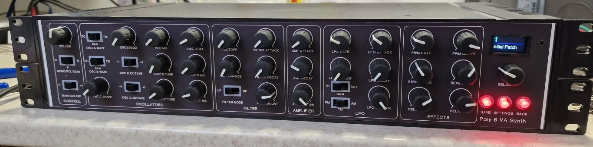

Teensy-Poly6

This is a polyphonic synth forked from albnys/TeensyPoly6 converted into a 2U 19" rack.

 

I have tidied up the files so it now compiles properly

The analogue interface now uses 6 MUX chips to read the pots and switches so there is no need to connect to the top or underneath of the Teensy 4.1 for the extra analogue inputs required. It runs smoother now as well.

The schematics are upto date now with the latest mux changes and a PCM1502A sound card.

The synth is built using a teensy 4.1 and is programmed in Arduino IDE using the teensy audio library, this gives us increased polyphony over the original 6 notes to 12.

How it sounds in the original keyboard form, this sound engine is unchanged.

https://www.youtube.com/watch?v=Exk_K2VwGu0

* Triple VCOs with octave +/- shift.
* Osc A with SAW, PULSE (PWM) and TRIANGLE waves, plus SUB and Crossmod
* Osc B with SAW, PULSE (PWM) and TRIANGLE waves, plus tuning, oct +/-
* Osc C with 28 waves, plus tuning, oct +/-
* LP/BP filter with resonance and env +/- for A/D/R
* LFO with SAW, TRIANGLE and SAMPLE & HOLD waves
* Modulation destinations for FM. TM and AM
* LFO attack, decay and sustain with depth control
* PWM LFO with rate and depth
* Digital reverb with size and mix amount
* Digital delay with time and mix amount
* Programmable ranges for Pitch, Modulation and Aftertouch
* Mono, Poly and Unison (2 to 12 voices) modes, Unison detune ranges
* Note priorities for Mono and Unison modes, Top, Bottom, Last.
* MIDI modulation, aftertouch, CC messages for controls, channel change, pitchbend.
* 999 memories with storage of all front panel controls except volume.
* MIDI In, Out, Thru
